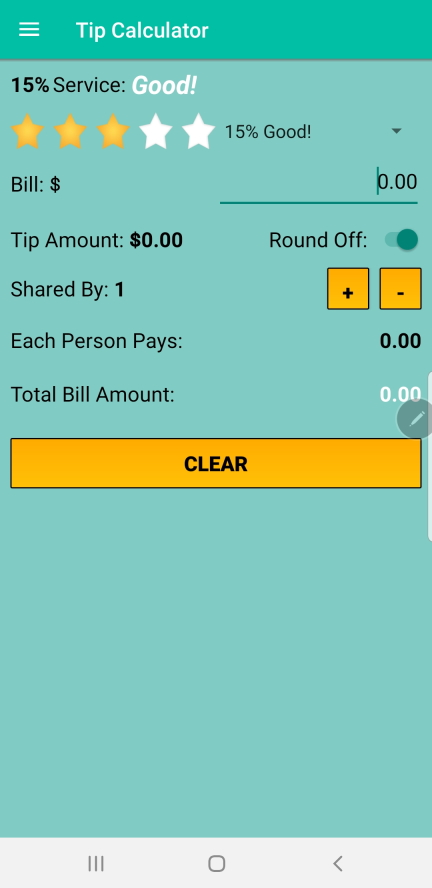
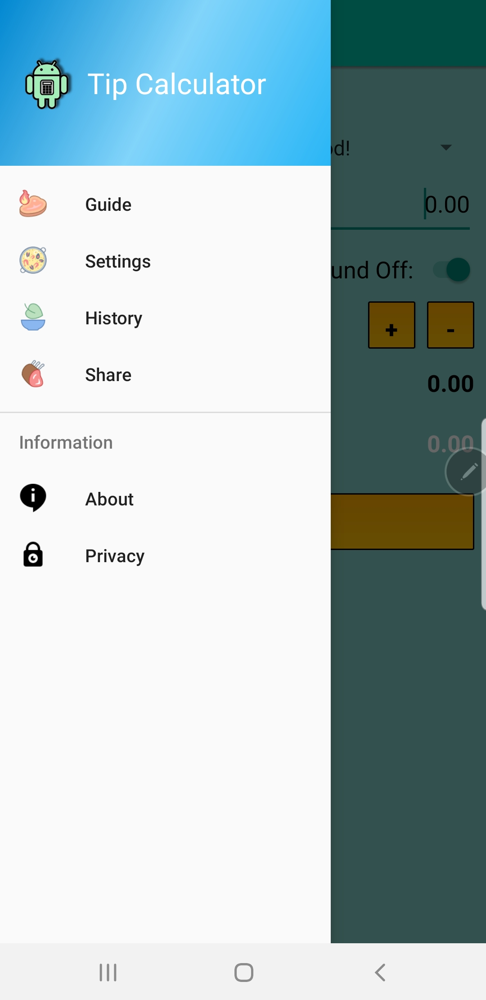
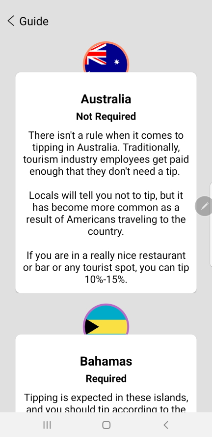

# Tip Calculator

This project is part of an open mentoring program ran by [Leonard Tatum](https://www.linkedin.com/in/leonard-tatum-768850105/). 
In this program various mobile applications are created and published in 24 hours. All participants receive
developer credit in the opening splash screen of the app.

This mentoring program is completely free, remote, and any individual can participate. The program runs on Saturday
mornings. We meet for 6 Saturdays, 4 hours each day. All levels of skill are welcomed. Checkout just a
few of the applications we have created.

1. [Tip Calculator](https://play.google.com/store/apps/details?id=com.blog.ljtatum.tipcalculator)
2. [Kids Education: Elements](https://play.google.com/store/apps/details?id=com.blog.ljtatum.elements)
3. [Kids Education: Eek! Math](https://play.google.com/store/apps/details?id=com.blog.ljtatum.eekmathi)
4. [Kids Education: Eek! Spelling](https://play.google.com/store/apps/details?id=com.blog.ljtatum.eekspellingi)
5. [AndroidX](https://play.google.com/store/apps/details?id=com.blog.ljtatum.androidx)

If you are interested in participating in this mentoring program, contact Leonard Tatum at ljtatum@hotmail.com.
Add the words, "Teach Me Sensei", in the subject line and he will get back to you with further arrangements. If
you have any other mobile app related inquiries or ideas, don't hesitate to reach out to talk shop.

## Table of Contents

* [Introduction](#introduction)
* [Screenshots](#screenshots)
* [Documentation](#documentation)
* [Social Media](#social-media)
* [BSD License](#bsd-license)

## Introduction

This is the world's most beautiful tip calculator. The application has everything you need for 
calculating and splitting tips. You can round off values, see how much each individual has to pay,
customize settings, tip history to track how much you are tipping and where, tipping guide for
other countries around the world, and more! Everything is free to use, no gimmicks. No obstructive
ads, no in-app purchases, no pay-to-play monetization models. Everything is completely free. 

This project was not created to earn money, it was created to help spread the love of Android
development. And change the lives of individuals involved. People who join Leonard Tatum's mentoring 
program often times are looking for a new career; a fresh start at life. This is their opportunity
to build up a development portfolio. Often times, the requirement to get through the doors of a tech
company as an entry level developer is a minimum of three published apps. Projects like this help
build the necessary coding requirements to start a new career. You can help support these
individuals by just downloading and sharing the app.

## Screenshots

## Documentation

The codebase for all projects created in the mentoring program is open and available for you to see.
Hopefully, there are some things you can learn no matter what development level you are at.

## Social Media

Leonard Tatum would love to hear from you. Although he receives several hundred messages a day,
he takes the time to respond back to everyone as promptly as possible. Don't be shy to reach out
about any mobile app related topics. Leonard loves to do side projects and can help you with any
task or job. Let's connect and continue spreading the love of Android development.

1. [Connect on LinkedIn](https://www.linkedin.com/in/leonard-tatum-768850105/)
2. [Follow on Twitter](https://twitter.com/drxeno02?lang=en)
3. [Lets be friends on Facebook](https://www.facebook.com/drxeno02)

## BSD license
Copyright (c) 2015 Leonard Tatum. All rights reserved.

Redistribution and use in source and binary forms are permitted provided that the above 
copyright notice and this paragraph are duplicated in all such forms and that any documentation, 
advertising materials, and other materials related to such distribution and use acknowledge that 
the software was developed by Leonard Tatum. The names of the developers may not be used to endorse 
or promote products derived from this software without specific prior written permission. 
THIS SOFTWARE IS PROVIDED ``AS IS'' AND WITHOUT ANY EXPRESS OR IMPLIED WARRANTIES, INCLUDING, 
WITHOUT LIMITATION, THE IMPLIED WARRANTIES OF MERCHANTABILITY AND FITNESS FOR A PARTICULAR PURPOSE.